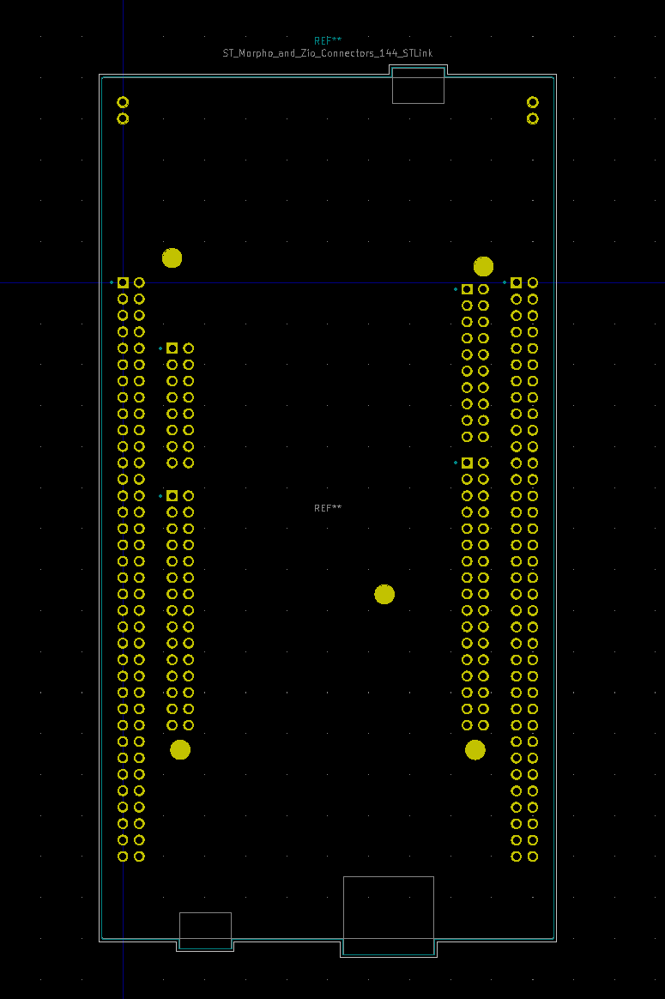

# Teh KiCad Components
My components for KiCad

## Symbol and Footprint for NUCLEO-144 with Zio and Morpho connectors
* Module.pretty\ST_Morpho_and_Zio_Connectors_144_STLink
* library\NUCLEO-FxxxZx.*

For NUCLEO-F207ZG, NUCLEO-F303ZE, NUCLEO-F412ZG, NUCLEO-F413ZH, NUCLEO-F429ZI, NUCLEO-F439ZI, NUCLEO-F446ZE, NUCLEO-F722ZE, NUCLEO-F746ZG, NUCLEO-F756ZG, NUCLEO-F767ZI, NUCLEO-H743ZI

